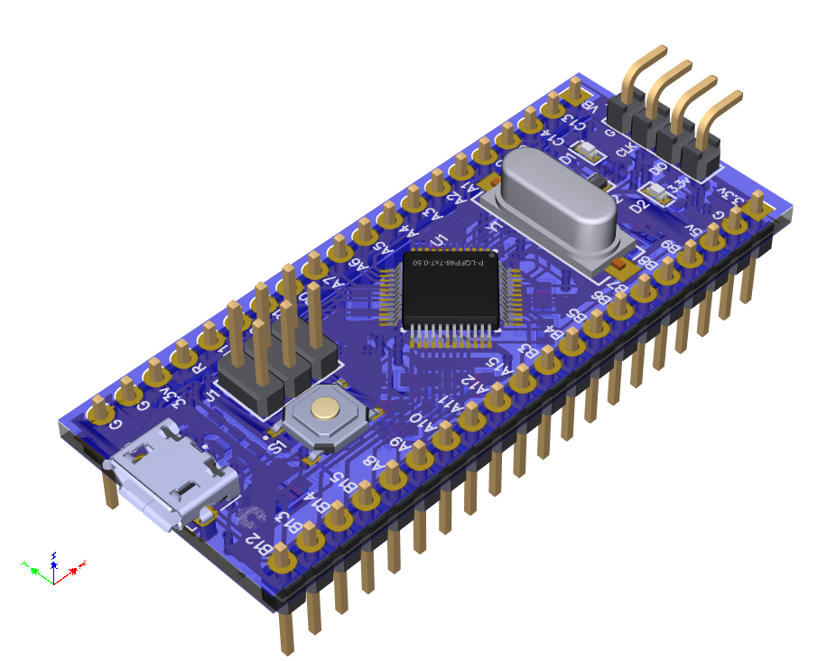
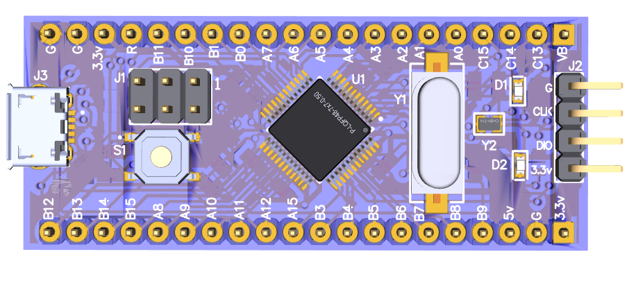
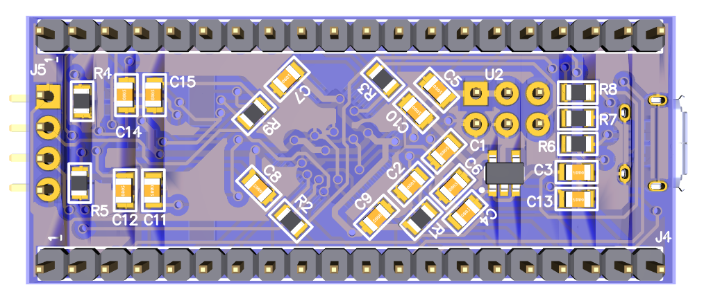
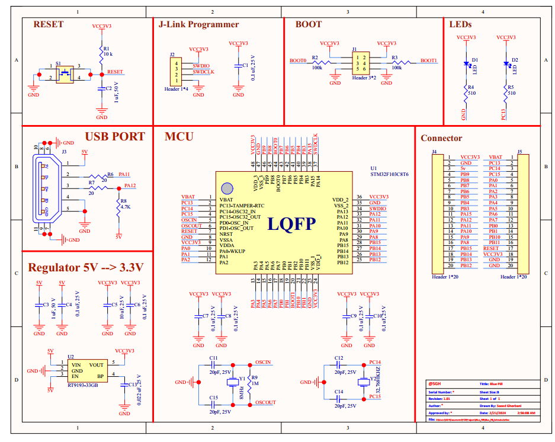

  
English

  <lang dir="ltr">

# BluePill-PCB
 STM32F103C8T6 Blue Pill Development Board contains a 32-bit Cortex-M3 RISC ARM core with an internal oscillator of 4 -16 MHz. It is a CMOS flash technology chip. This chip has 37 GPIO pins and 10 Analog pins. 

 # Blue Pill PCB Design

This repository contains the PCB design files for the Blue Pill module created using Altium Designer.

## Introduction

The Blue Pill PCB is a work-in-progress development board based on the STM32 microcontroller. This repository contains the Altium Designer project files for the partially completed PCB design. The purpose of this repository is to collaborate on the development of the Blue Pill PCB and to track its progress.

## Files

- **Blue_Pill.PrjPcb**: Altium Designer project file containing schematic and partially completed PCB layout.
- **Blue_Pill_Sehmatic.SchDoc**: Schematic file for the Blue Pill PCB.
- **Blue_Pill_pcb.PcbDoc**: Partially completed PCB layout file for the Blue Pill PCB.
- **Blue_Pill_LIB.LibPkg**: Library components.

## Usage

To contribute to the completion of the PCB design:
1. Clone this repository to your local machine.
1. Open the Altium Designer project file (`lue_Pill.PrjPcb`).
2. Review the schematic (`Blue_Pill_Sehmatic.SchDoc`) and partially completed PCB layout (`Blue_Pill_pcb.PcbDoc`).
3. Contribute by completing the PCB layout or providing feedback on the design.

## Contributing

Contributions to complete the PCB layout or improve the design are welcome. If you find any issues or have suggestions, feel free to open an issue or submit a pull request.

## License

This project is licensed under the [MIT License](LICENSE).
...
  </lang>

  
فارسی

<lang dir="rtl">

### راهنما (فارسی)

# طراحی PCB Blue Pill

این مخزن شامل فایل‌های طراحی PCB برای ماژول Blue Pill است که با استفاده از نرم‌افزار Altium Designer ایجاد شده است.

## مقدمه

مدار PCB Blue Pill یک بورد توسعه در حال پیشرفت است که بر اساس میکروکنترلر STM32 است. این مخزن حاوی فایل‌های پروژه Altium Designer برای طراحی  PCB است. هدف این مخزن ایجاد همکاری در توسعه PCB Blue Pill و پیگیری پیشرفت آن است.

## فایل‌ها

- **Blue_Pill.PrjPcb**: فایل پروژه Altium Designer که شامل شماتیک و PCB است.
- **Blue_Pill_Sehmatic.SchDoc**: فایل شماتیک برای PCB Blue Pill.
- **blue_pill_pcb.pcbdoc**: فایل PCB برای PCB Blue Pill.
- **Blue_Pill_LIB.LibPkg**: کتابخانه قطعات
## استفاده

برای کمک به تکمیل طراحی PCB:
1. این مخزن را بر روی ماشین محلی خود کلون کنید.
2. فایل پروژه Altium Designer (`Blue_Pill.PrjPcb`) را باز کنید.
3. شماتیک (`Blue_Pill_Sehmatic.SchDoc`) و PCB (`blue_pill_pcb.pcbdoc`) را بررسی کنید.
4. با تکمیل PCB یا ارائه بازخورد در طراحی، همکاری کنید.

## مشارکت

همکاری‌ها برای تکمیل PCB یا بهبود طراحی مورد استقبال است. اگر هر گونه مشکلی را پیدا کردید یا پیشنهادی دارید، لطفاً یک مشکل را باز کنید یا درخواست pull ارسال کنید.

## لایسنس

این پروژه تحت [مجوز MIT](LICENSE) منتشر شده است.

این فایل README دوزبانه حاوی اطلاعات مربوط به طراحی PCB Blue Pill است که با استفاده از Altium Designer ایجاد شده است. این فایل به کاربران اجازه می‌دهد که به راحتی اطلاعات مربوط به PCB و نرم‌افزار Altium را مشاهده کنند و از طراحی شما بهره‌مند شوند.
